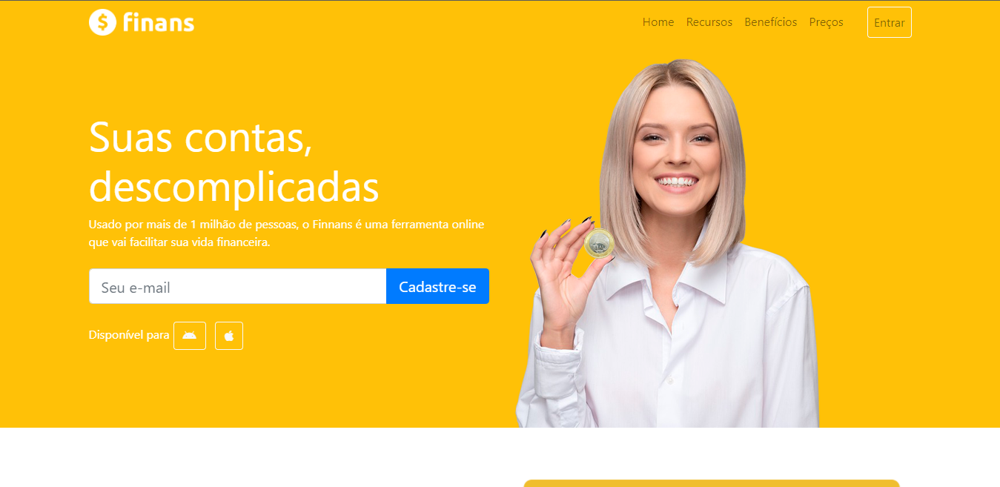

<h1 align="center">
    
</h1>

<h1>
    
</h1>

## 📝 Sobre
O projeto **Finans** é um site de finanças fictício e é uma site responsivo que foi utilizado com a biblioteca Bootstrap. O projeto foi criado dentro do curso de **Desenvolvimento Web** na plataforma da Udemy, ministrado pelos professores Jamilton Damasceno e Jorge Sant Anna com o objetivo de colocarmos em prática todo conteúdo estudado dentro do módulo de Bootstrap 4.

---

## 🚀 Tecnologias utilizadas

O projeto foi desenvolvido com as seguintes tecnologias:

- HTML
- CSS
- BOOTSTRAP
- JavaScript
